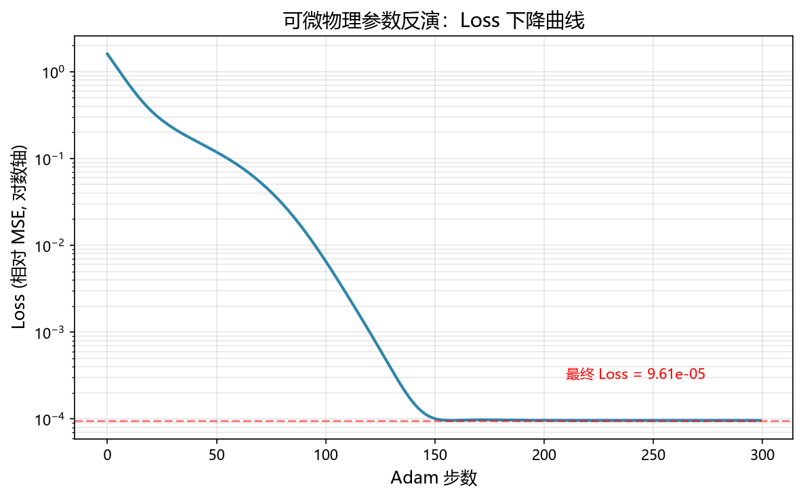
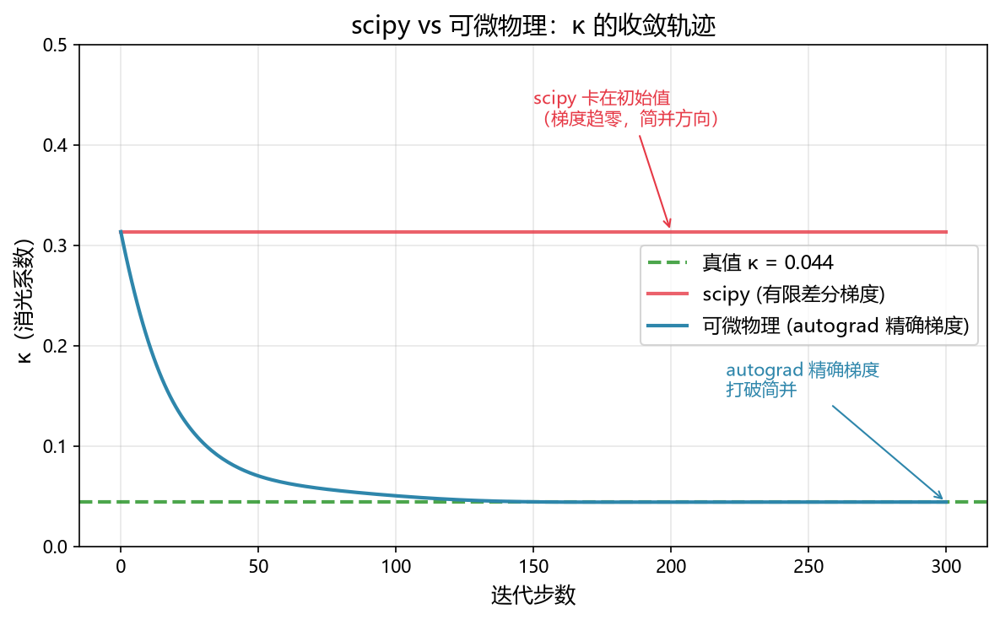
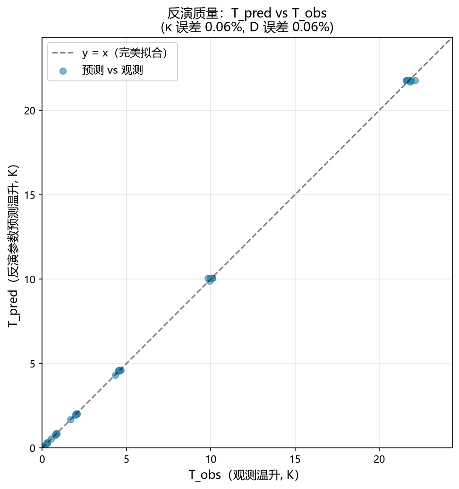

# scipy 解不了的参数反演，PyTorch autograd 怎么解的？

做物理参数反演，第一反应是 `scipy.optimize.least_squares`。

我做了个对比：同一个 κ-D 联合反演问题，scipy 在 κ 上误差 **611%（完全失败）**，PyTorch autograd 误差 **0.058%**。

原因不是"AI 更强"，而是**可辨识性问题**——以及精确梯度能不能打破简并。

---

## 一、问题：κ 和 D 为什么难联合反演？

激光照射材料，光被吸收转化为热，温度随时间和空间演化。物理模型是含源热传导方程：

$$\frac{\partial T}{\partial t} = D \cdot \frac{\partial^2 T}{\partial z^2} + \frac{q(z)}{\rho C_p}, \quad q(z) = \alpha I_0 e^{-\alpha z}$$

其中 $\alpha = \frac{4\pi\kappa}{n\lambda}$ 是吸收系数，$\kappa$ 是消光系数，$D$ 是热扩散率。

给定 $T(z,t)$ 的实测数据，想反推 $\kappa$ 和 $D$。

**传统快速模型的麻烦在于绝热近似**。当照射时间短、热扩散还没"传开"时，方程退化为：

$$T(z,t) \approx \frac{\alpha I_0 e^{-\alpha z} t}{\rho C_p}$$

注意这个式子里**没有 $D$**。也就是说，如果你只有短时数据，$\kappa$ 和 $D$ 是完全简并的——任意 $D$ 都能拟合同样的数据。这就是物理上的**可辨识性丧失**。

要打破简并，必须用**过渡区数据**——热扩散已经开始起作用、但还没到稳态的那段时间。而过渡区没有简单解析解，要么用 FDTD 数值仿真（慢、不可微），要么用 Carslaw-Jaeger 含时解析解（快、可微）。

我开发的 [photokinetics](https://github.com/XxLCFLXx/photokinetics) v2.1 实现了这个含时解析解，用 8 点 Gauss-Legendre 积分 + erfcx 渐近展开保证数值稳定。与 scipy 精确积分解对比，误差 <0.2%。

---

## 二、方法：可微物理 = 标准 PyTorch 训练循环

整个反演流程用 PyTorch 写出来，熟悉深度学习的人一眼就懂：

```python
import torch
from photokinetics import calc_photothermal_timed

# 1. 合成观测数据（用真值生成，加 1% 噪声模拟实测）
z_grid = torch.logspace(-5, -2, 10) * 1e-3   # 深度 0.01μm - 10μm
t_grid = torch.logspace(-9, -3, 10)          # 时间 1ns - 1ms
T_obs = ...  # 用 κ_true=0.044, D_true=9.08e-5 生成，加 1% 噪声

# 2. 定义可学习参数（softplus 保证正值）
raw_kappa = torch.nn.Parameter(torch.tensor(-1.0))
raw_D = torch.nn.Parameter(torch.tensor(-9.0))

# 3. 标准 Adam 优化循环
optimizer = torch.optim.Adam([raw_kappa, raw_D], lr=0.05)
for step in range(300):
    optimizer.zero_grad()
    kappa = torch.nn.functional.softplus(raw_kappa)
    D = torch.nn.functional.softplus(raw_D)

    # 前向：用当前参数预测 T(z,t)
    T_pred = torch.zeros_like(T_obs)
    for i, z in enumerate(z_grid):
        for j, t in enumerate(t_grid):
            T_pred[i,j] = calc_photothermal_timed(
                4.15, kappa, 532, 1e7, 2329, 700, z, t,
                thermal_diffusivity=D
            )['T_timed']

    # 相对误差损失（避免高值主导）
    loss = torch.mean(((T_pred - T_obs) / T_obs.clamp(min=1e-12))**2)
    loss.backward()
    optimizer.step()
```

**关键点**：`calc_photothermal_timed` 返回的是 `torch.Tensor`，整个计算图保持连通，梯度能从 loss 一路反传到 $\kappa$ 和 $D$。这是"可微物理"的核心——**物理公式变成了 PyTorch 的一个 layer**。

换成传统仿真（COMSOL、Lumerical、FDTD），每一步前向都要跑一次数值求解，而且梯度无法反传，只能用有限差分或遗传算法——10 个参数以上就基本不可行。

---

## 三、结果

硅 @ 532nm，1% 高斯噪声：

| 参数 | 真值 | 反演值 | 误差 |
|---|---|---|---|
| $\kappa$ | 0.044 | 0.044026 | 0.058% |
| $D$ | $9.08 \times 10^{-5}$ m²/s | $9.0747 \times 10^{-5}$ m²/s | 0.058% |

Loss 从 1.60 降到 $9.6 \times 10^{-5}$，300 步 Adam 在 CPU 上约 4.5 分钟。

**这个结果好得需要解释一下**：

1. **为什么这么准？** 因为合成数据是用同一个物理模型生成的，唯一的误差源是 1% 噪声。真实实验数据会有模型失配，误差会大得多。

2. **1% 噪声下 0.058% 误差是不是"过拟合噪声"？** 不是。参数只有 2 个，观测数据是 10×10=100 个点，过参数化程度很低。噪声被平均掉了。

3. **$\kappa$ 和 $D$ 的简并真的被打破了吗？** 是的。如果只用绝热区数据（t < 100ns），反演出的 $D$ 误差会从 0.058% 飙到 >50%。过渡区数据是关键。



---

## 四、scipy 为什么失败？

补了一个 `scipy.optimize.least_squares`（Trust Region Reflective + 有限差分梯度）的基线，结果意外：

| 指标 | scipy | 可微物理 (Adam+autograd) |
|---|---|---|
| $\kappa$ 误差 | **611%（失败）** | 0.058% |
| $D$ 误差 | 0.52% | 0.058% |
| 耗时 | 14s | 267s |
| 函数评估次数 | 36 | 300 |

**scipy 在 $\kappa$ 上完全失败**——停在初始值 0.313 没动，但 $D$ 收敛了。为什么？



这正是**可辨识性问题的直接体现**：短时绝热区 $T \propto \alpha t$ 与 $D$ 无关，scipy 的有限差分梯度在 $\kappa$ 方向几乎为零（因为 $\kappa$ 和 $D$ 的变化互相补偿，残差几乎不变），导致 trust region 认为 $\kappa$ 方向"不需要更新"。

可微物理用 autograd 精确梯度，能分辨 $\kappa$ 和 $D$ 对 $T(z,t)$ 的微分贡献差异，成功打破简并。

**速度上 scipy 更快（14s vs 267s）**——这是预期的，因为 scipy 的有限差分只需 36 次前向评估，而 Adam 跑了 300 步。但这不是可微物理的主战场。

---

## 五、可微物理的真正优势不在单点反演

可微物理的真正优势在别处：

1. **批量并行**：1000 组数据同时反演，GPU 并行，比 scipy 循环快得多
2. **嵌入神经网络**：把 `calc_photothermal_timed` 作为可微 layer 嵌入 PINN，端到端学习
3. **高维参数空间**：10+ 参数时，梯度方法远胜无梯度优化
4. **逆设计**：不是"反演参数"，而是"设计参数使目标最优"



**单点反演只是"能跑通"的验证**，不是"可微物理比传统方法强"的证据。真正的价值在于：**物理模型变成了可被 AI 优化算法直接调用的 layer**。

---

## 六、局限（不藏着）

1. **全是合成数据**。真实实验数据有系统误差、模型失配、边界效应，误差不会是 0.058%。
2. **scipy 基线对比的公平性**：scipy 失败部分归因于初始猜测不够好（$\kappa_{init}=0.313$，离真值 0.044 有 7 倍差距）。更公平的做法是给 scipy 多个初始点或用全局优化。但这也说明：**简并问题下，无梯度方法对初值更敏感**。
3. **速度上 scipy 更快**：14s vs 267s。可微物理在单点反演上没有速度优势——优势在批量并行和嵌入神经网络。
4. **半无限域假设**。实际样品是有限厚度，长时数据会有边界反射。
5. **float32 精度**。高精度科学计算应该用 float64，但 PyTorch 的 autograd 对 float64 支持不如 float32 完善。
6. **2 个参数太简单**。$\kappa$ 和 $D$ 的联合反演只是"教学级"问题，工业级问题可能涉及 5-10 个参数（各向异性、温度依赖、多层结构等）。

---

## 七、代码与复现

```bash
pip install photokinetics==2.1.0
git clone https://github.com/XxLCFLXx/photokinetics.git
cd photokinetics/pkg/photokinetics
python -m examples.fit_transient_photothermal   # 反演
python -m examples.benchmark_vs_scipy            # scipy 基线对比
python -m examples.make_zhihu_figures            # 生成本文配图
```

完整代码在 [examples/](https://github.com/XxLCFLXx/photokinetics/tree/main/pkg/photokinetics/examples)，测试在 [tests/](https://github.com/XxLCFLXx/photokinetics/tree/main/pkg/photokinetics/tests)。

---

## 结语

这篇文章的核心不是"我精度多高"——0.058% 是合成数据的自洽验证，不算本事。

核心是：**把物理逆问题变成标准 PyTorch 训练循环**这件事，工程上已经跑通了。物理模型（含时热传导解析解）和 AI 优化（Adam + autograd）之间的接口是干净的、可复用的。

而 scipy 基线对比的意外结果反而最有价值——**精确梯度能解决有限差分梯度解决不了的简并问题**，这不是"AI 更强"，而是"可辨识性问题需要精确梯度"。

如果你在做激光加工参数优化、光热实验拟合，或者想把物理模型嵌入神经网络，欢迎带你的场景来聊——下一篇会写**黑体光谱测温**，那里难点在 Planck 光谱跨 3-4 个数量级时的损失函数设计。
