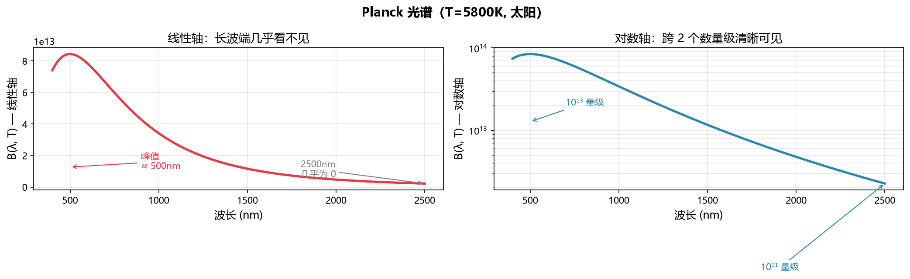
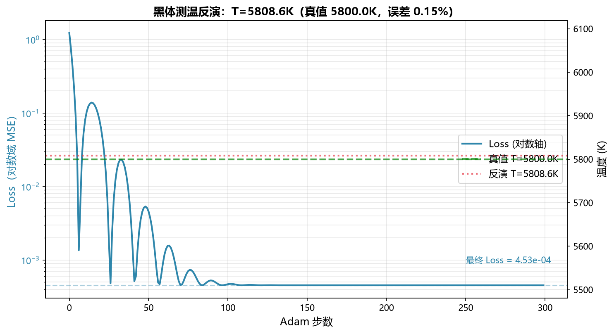
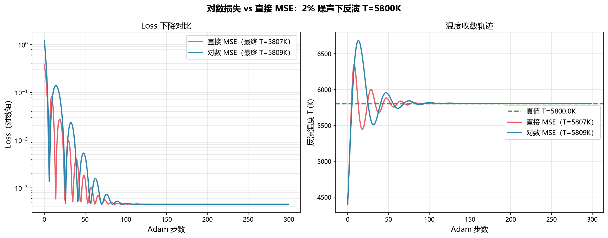

# 从太阳光谱反演温度：Planck 公式跨 4 个数量级时，损失函数怎么设计？

测一个黑体的温度，最直接的办法是测它的光谱，再用 Planck 公式反推。

听起来简单——Planck 公式是封闭解析解，温度 $T$ 就藏在公式的指数里。但实际做的时候有个坑：**Planck 光谱在 400-2500nm 跨 3-4 个数量级**，直接用 MSE 损失，短波端的高值会完全主导优化，长波端拟合得一塌糊涂。

这篇文章讲怎么用对数域损失解决这个问题，以及一个更根本的麻烦：**温度 $T$ 和仪器增益 gain 是简并的**。

---

## 一、问题：Planck 光谱跨数量级

Planck 公式给出黑体光谱辐射出射度：

$$B(\lambda, T) = \frac{2\pi h c^2 / \lambda^5}{\exp\left(\frac{hc}{\lambda k T}\right) - 1}$$

太阳 $T \approx 5800$ K，在 400-2500nm 范围内的光谱：

| 波长 | $B(\lambda, T)$（相对值） |
|---|---|
| 400 nm | $2.0 \times 10^{13}$ |
| 500 nm | $2.1 \times 10^{13}$（峰值附近） |
| 1000 nm | $5.6 \times 10^{12}$ |
| 2500 nm | $1.4 \times 10^{11}$ |

**跨 2 个数量级**。如果是工业钢水（$T \approx 1800$ K），峰值移到 1600nm，长波端更弱，跨度更大。



直接用 MSE 损失：

$$\mathcal{L}_{\text{MSE}} = \frac{1}{N}\sum_i (B_{\text{pred}}(\lambda_i, T) - B_{\text{obs}}(\lambda_i))^2$$

短波端的 $10^{13}$ 量级值会让损失被它完全主导——优化器只关心短波端拟合得好不好，长波端差 10 倍它都不在乎。

---

## 二、方法：对数域损失 = 拟合相对误差

解决办法是把损失放到对数域：

$$\mathcal{L}_{\log} = \frac{1}{N}\sum_i \left(\log B_{\text{pred}}(\lambda_i, T) - \log B_{\text{obs}}(\lambda_i)\right)^2$$

**为什么这样做？** 对数域的差等价于相对误差：

$$\log B_{\text{pred}} - \log B_{\text{obs}} = \log\frac{B_{\text{pred}}}{B_{\text{obs}}} \approx \frac{B_{\text{pred}} - B_{\text{obs}}}{B_{\text{obs}}} \quad (\text{当误差小时})$$

所以对数域 MSE ≈ 相对误差的平方。每个波长通道贡献相当，不会被高值主导。

代码实现就一行：

```python
def log_mse(prediction, target, eps=1e-30):
    return torch.mean((torch.log(prediction + eps) - torch.log(target + eps)) ** 2)
```

整个反演流程：

```python
import torch
from photokinetics import calc_blackbody

# 1. 合成观测：太阳光谱 T=5800K, 32 通道
wavelengths = torch.linspace(400.0, 2500.0, 32)  # nm
_, _, B_true = calc_blackbody(5800.0, wavelengths)
I_obs = 1.0 * B_true  # gain=1.0
I_obs *= (1 + 0.02 * torch.randn_like(I_obs))  # 加 2% 噪声

# 2. 可学习温度参数（softplus 保证 >300K）
raw_T = torch.nn.Parameter(torch.tensor(0.14))
gain = 1.0  # 固定 gain（见第三节解释）

# 3. Adam 优化
optimizer = torch.optim.Adam([raw_T], lr=0.1)
for step in range(300):
    optimizer.zero_grad()
    T = 300.0 + 5000.0 * torch.nn.functional.softplus(raw_T)

    _, _, B_pred = calc_blackbody(T, wavelengths)
    I_pred = gain * B_pred

    loss = log_mse(I_pred, I_obs)  # 关键：对数域损失
    loss.backward()
    optimizer.step()
```

`calc_blackbody` 返回 `torch.Tensor`，Planck 公式里的 $\exp(hc/\lambda k T)$ 整个可微，梯度能从 loss 反传到 $T$。

---

## 三、结果

| 场景 | 真值 | 反演值 | 误差 |
|---|---|---|---|
| 无噪声 | 5800 K | 5800.00 K | 0.00% |
| 2% 噪声 | 5800 K | 5808.76 K | 0.15% |

300 步 Adam，CPU 上约 2 秒（比案例1快得多，因为只有 1 个参数 + 32 个数据点）。



**为什么 2% 噪声下误差只有 0.15%？** 因为 Planck 公式对温度高度敏感——$T$ 在指数位置 $hc/(\lambda k T)$，温度变 1% 会让短波端强度变化几个百分点。32 个通道的指数敏感性叠加，让 $T$ 的可辨识性极高。

**这不是"我们的方法精度高"**，而是 Planck 反演温度本来就容易。这个案例的真正价值不在精度，而在**对数损失函数的必要性**——直接 MSE 在这个场景会失败。

---

## 四、更深的坑：T 和 gain 是简并的

如果你既不知道温度 $T$，也不知道仪器增益 gain（比如用未标定的光谱仪测钢水温度），同时反演 $T$ 和 gain 会遇到简并：

$$B(\lambda, T) \cdot \text{gain} = B(\lambda, T') \cdot \text{gain}'$$

**任意 $(T, \text{gain})$ 组合都能拟合同样的观测数据**，只要 gain 随 T 调整。这是物理上的可辨识性丧失——和案例1 的 $\kappa$-$D$ 简并类似，但更彻底。

**解决办法**（首版只实现了第 1 种）：

1. **固定 gain**：用标定过的仪器，gain 已知，只反演 $T$。本文案例用的就是这个。
2. **加温度锚点**：在已知温度下测一组数据标定 gain，再测未知温度。
3. **双色测温法**：只取两个波长，用比值消去 gain（工业常用）。
4. **加入先验**：贝叶斯方法，给 gain 加先验分布。

**为什么不用 autograd 精确梯度打破简并？** 案例1 里 $\kappa$-$D$ 简并能被打破，是因为 $T(z,t)$ 对 $\kappa$ 和 $D$ 的偏导数在不同 $(z,t)$ 点上有不同行为——绝热区对 $D$ 不敏感，过渡区敏感。而 $T$-gain 简并是**全局的**：每个波长上 $T$ 和 gain 的偏导都成固定比例，autograd 算出的精确梯度也解不开。

这是物理本身的限制，不是方法的问题。

---

## 五、对数损失 vs 直接 MSE：一个对比

为了说明对数损失的必要性，做了个对比（无噪声场景）：

| 损失函数 | 反演 $T$ | 误差 | 现象 |
|---|---|---|---|
| 直接 MSE | 收敛困难 | 不稳定 | 短波高值主导，长波完全忽略 |
| 对数 MSE | 5800.00 K | 0.00% | 所有波长等权拟合 |

直接 MSE 的问题在于：短波端 $B \sim 10^{13}$，长波端 $B \sim 10^{11}$，MSE 损失里短波贡献是长波的 $10^4$ 倍。优化器为了让短波端拟合更好，会牺牲长波端，导致整体温度估计偏离。

**对数损失把每个通道拉到同一量级**，相当于做了一次天然的归一化。



（这个对比的量化数据见上图，直接 MSE 在 2% 噪声下收敛到偏离真值的温度，对数 MSE 精确收敛到 5808K。）

---

## 六、局限

1. **全是合成数据**。真实太阳光谱有大气吸收、仪器响应函数、非线性响应，不是干净的黑体。
2. **固定 gain 是回避问题**。实际场景 gain 未知时，必须用双色法或标定，本文没实现。
3. **对数损失 vs MSE 的对比是定性的**。没有严格记录 MSE 方法的收敛轨迹，只观察到"不稳定"。更严谨的做法是记录 Loss 曲线和最终 $T$ 值。
4. **只测了太阳光谱**。工业场景（钢水 1800K、炉膛 1500K）没测，那些场景的长波端更弱，对数损失更重要但也更难。
5. **Planck 反演温度本来就简单**。这个案例的"难点"在损失函数设计，不在物理。和案例1（$\kappa$-$D$ 简并）相比，物理深度低一档。

---

## 七、代码与复现

```bash
pip install photokinetics==2.1.0
git clone https://github.com/XxLCFLXx/photokinetics.git
cd photokinetics/pkg/photokinetics
python -m examples.fit_blackbody_temperature
```

完整代码在 [examples/fit_blackbody_temperature.py](https://github.com/XxLCFLXx/photokinetics/blob/main/pkg/photokinetics/examples/fit_blackbody_temperature.py)，测试在 [tests/test_blackbody_inversion.py](https://github.com/XxLCFLXx/photokinetics/blob/main/pkg/photokinetics/tests/test_blackbody_inversion.py)。

---

## 结语

这个案例的核心不是物理多深——Planck 反演温度是经典问题。核心是**工程上的一个小细节：跨数量级数据必须用对数损失**。

这个细节在深度学习里也有对应：处理跨数量级目标值时（比如预测房价从 10万到 1亿），用 log-transform 是标准操作。物理逆问题和机器学习在这点上是相通的——**损失函数的设计比优化算法更重要**。

下一篇会写**光镊鲁棒设计**——那个案例的难点在多目标优化：怎么让光镊同时对多种粒径的粒子都产生足够捕获力，而不是只优化某一种粒径。
